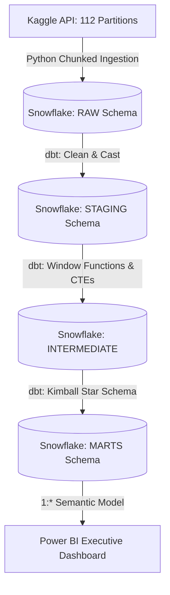

# UK Energy Grid Performance & Analytics Pipeline

## 📌 Project Overview
This project is an end-to-end **Analytics Engineering pipeline** built to process, transform, and model high-frequency energy telemetry data. Processing over **3.5 million rows** across 112 partitions, the objective was to bridge the gap between raw operational data and executive-level business intelligence.

By migrating from a flat-file structure to a **Modern Data Stack (Snowflake, dbt, Power BI)**, this pipeline solves common industry challenges including BI latency, data duplication, and inconsistent metric definitions.

---

## 🏗️ Architecture & Pipeline Flow

The pipeline follows a modular ELT (Extract, Load, Transform) architecture.

---
### Automated Data Lineage (DAG)

---
## 🛠️ Engineering Best Practices Implemented

### 1. Secure & Scalable Ingestion (Python)
* **Dynamic Partition Discovery:** Handled data volatility by implementing an automated file-iterator to ingest 112 individual CSV blocks dynamically.
* **Memory Optimization:** Utilized chunked ingestion logic (100k rows/batch) via the Snowflake Python Connector to prevent memory overflow in the cloud environment.
* **Zero-Trust Security:** Decoupled all database credentials using `python-dotenv` and `.gitignore` to ensure zero credential leakage in source control.

### 2. Analytics Engineering & Modeling (dbt)
* **Surrogate Keys:** Generated unique row identifiers using `MD5()` hashing at the staging layer to guarantee 100% data integrity and prevent many-to-many fan-outs.
* **Advanced SQL Transformations:** Offloaded complex calculations (7-Day Rolling Averages, Day-over-Day Variance, and Decile Rankings via `NTILE`) to the Snowflake warehouse to ensure BI tools remain highly performant.
* **Defensive Modeling:** Handled dirty data and dimensional orphans using strict `HAVING` clauses and data type casting.

### 3. Data Quality & Governance
* **Automated Testing:** Codified business assumptions in `schema.yml` and `marts.yml`. Enforced `unique`, `not_null`, and `relationships` (referential integrity) tests across the pipeline.
* **FinOps (Cost Control):** Configured Snowflake infrastructure with `AUTO_SUSPEND = 60` to optimize cloud compute spend.
* **Strategic Materialization:** Configured staging and intermediate layers as `views` to reduce storage costs, while materializing the final Marts as `tables` to maximize downstream query performance.

---

## 📊 The Semantic Layer (Power BI)

The final data product is a strict **Kimball Star Schema** ingested into Power BI via Import Mode.

* **Fact Table:** `fct_daily_energy` (Grain: 1 row per meter, per day).
* **Dimension Table:** `dim_households` (Grain: 1 row per unique household).
* **Governance:** Raw numeric columns and foreign keys are hidden from the report view. All aggregations are handled via explicit DAX measures (e.g., `DIVIDE`, `DISTINCTCOUNT`) in a dedicated Key Measures table to ensure a single source of truth.

### Executive Dashboard

---

## 💻 Technology Stack
* **Cloud Data Warehouse:** Snowflake
* **Data Transformation:** dbt (Data Build Tool) Core / Cloud
* **Data Ingestion:** Python (Pandas, Snowflake Connector)
* **Version Control:** Git & GitHub (Branch/PR Workflow)
* **Business Intelligence:** Power BI (DAX, VertiPaq)
 
